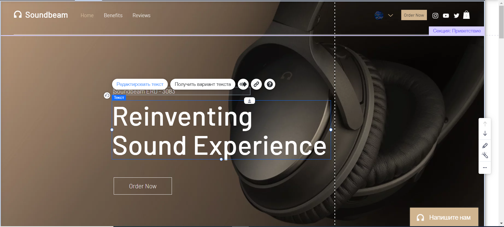
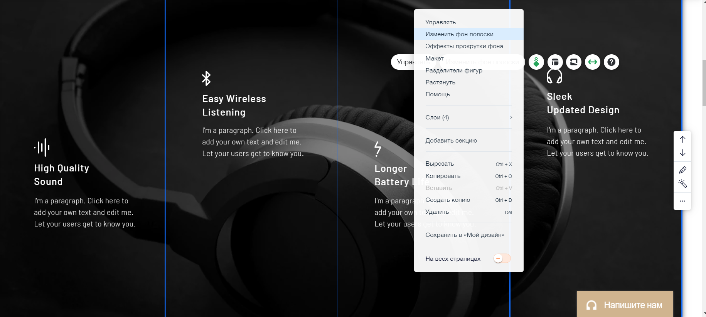
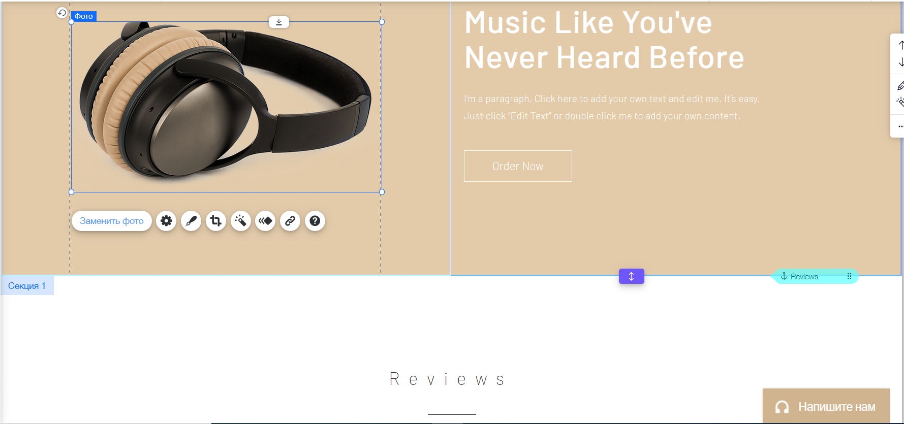
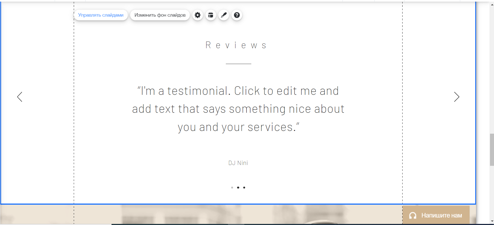
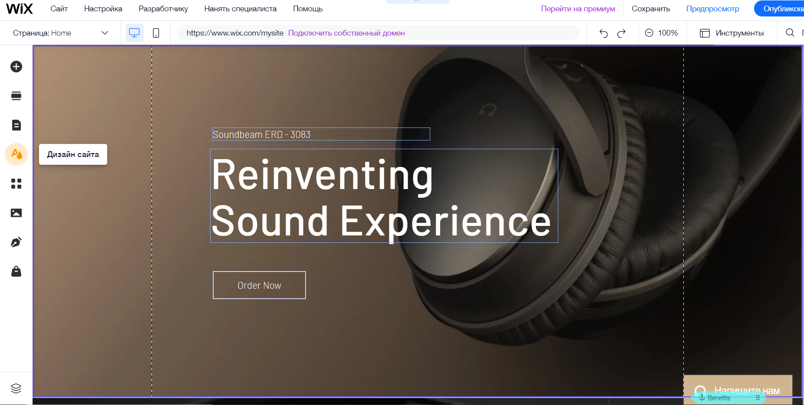
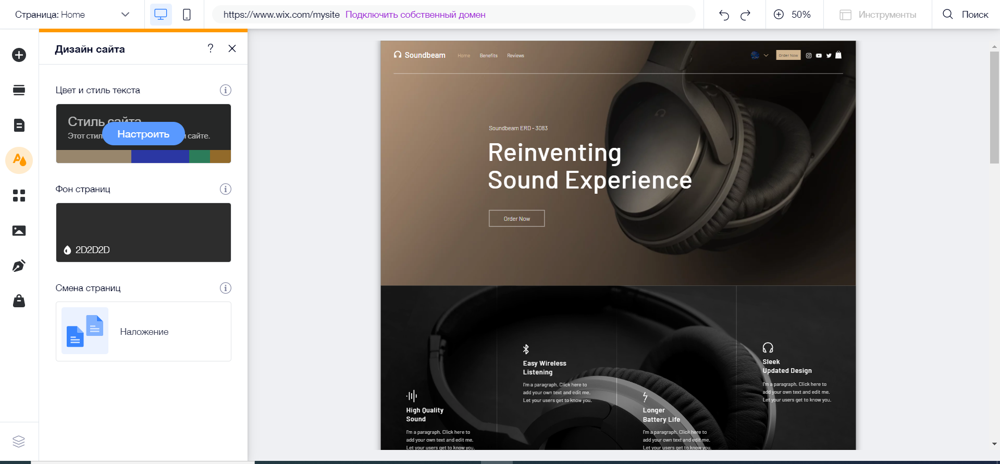
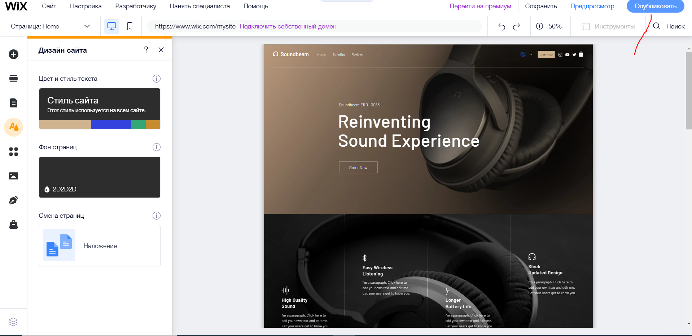

# Як створити сайт на wix
---
Спочатку нам потрібно зареєструватись на сайті. Далі ми повинні створити новий сайт, перший пункт з вибором категорії сайту ми пропускаємо. В наступному кроці пишемо назву сайту, далі обираємо функціонал сайту. Я пропоную обрати лише функціонал інтернет магазину, але ви можете обрати ще якісь функції. Після цього обираємо створити сайт по шаблону, нам підходить шаблон "Лендінг продуктів". Обираємо його через пошук та иснемо кнопку редагувати. У нас відкриється таке вікно:

---
# Як редагувати текст
---
Клікаємо на будь який текст і тиснемо редагувати

---
# Як змінювати фон
---
Клікаємо на фон і тиснемо змінити фон

---
# Як заміняти фото
---
Клікаємо на фото і тиснемо замінити фото

---
# Як редагувати слайдер
---
Клікаємо на слайдер і тиснемо керувати слайдами

---
## Таким чином змінюємо усі елементи сайту
---
# Як редагувати меню
---
Клікаємо на меню і тиснемо налаштувати

---
# Як змінити кольори
---
Тиснемо сюди:

І обираємо кольори:

---
# Як опублікувати сайт
---
Тиснемо кнопку опублікувати і обираємо безкоштовний домен

Далі нам видасть посилання на наш сайт

---
# Тепер наш сайт повністю готовий
---
## Сподіваюся мій туторіал був корисним!